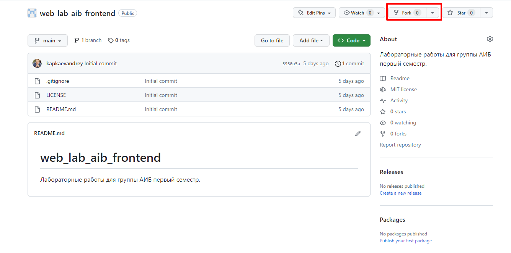
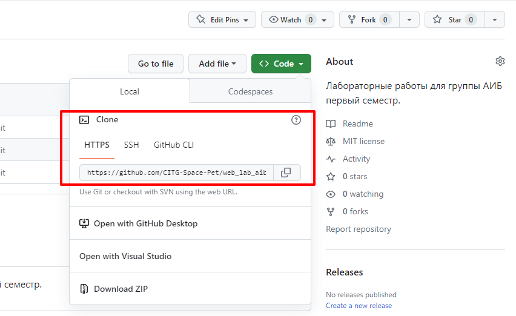
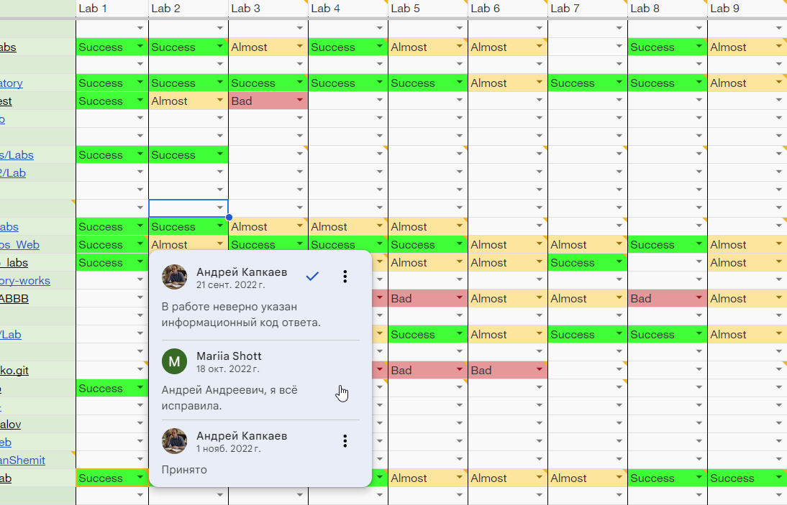

# Веб программирование курс лабораторных работ
## <span style="color:#4b0082">_Первый семестр_</span>
> ***Стив Джобс***
>> Начинай с малого, но мечтай о великом. Не занимайся одновременно слишком многими вещами. 
> Займись сначала немногими простыми делами, и постепенно переходи к более сложным. 
> И всегда думай о будущем.

______________________________________________________________________________
______________________________________________________________________________
## Навигация:

### [Интро](#intro)

### [Что понадобиться для работы](#must_have)

### [Мои лабы, мой репозиторий](#repo_fork)

### [Как сдавать на проверку лабы](#review)

### [Как понять, что лабораторная принята](#approved_rejected)

### [Обязательно к прочтению](#read_this)

______________________________________________________________________________
______________________________________________________________________________
### Интро<a name="intro"></a>
Если вы это читаете, то вы или случайно наткнулись на данный репозиторий, либо вам посчастливилось попасть нак курс
веб-программирования.  
И так, в данном репозитории будут находиться все задания лабораторных работ по указанному выше курсу. 
Данный репозиторий может и будет дополняться, задания могут быть модифицированы и улучшены так же если вы хотите предложить улучшение
в какой-либо из работ, с удовольствием познакомимся с вашим **PR**.
______________________________________________________________________________
### Что понадобиться для работы<a name="must_have"></a>
Для выполнения лабораторных работ вам понадобиться:
1) аккаунт на [**Github**](https://github.com/). Зарегистрироваться будет довольно просто.
2) Для работы вам понадобиться [**Git**](https://git-scm.com/), если вы владелец Windows вам пригодиться установиться себе [**GitBash**](https://git-scm.com/download/win)
3) Настроить **git bash** для работы следуя официальной [инструкции](https://git-scm.com/book/ru/v2/%D0%92%D0%B2%D0%B5%D0%B4%D0%B5%D0%BD%D0%B8%D0%B5-%D0%9F%D0%B5%D1%80%D0%B2%D0%BE%D0%BD%D0%B0%D1%87%D0%B0%D0%BB%D1%8C%D0%BD%D0%B0%D1%8F-%D0%BD%D0%B0%D1%81%D1%82%D1%80%D0%BE%D0%B9%D0%BA%D0%B0-Git)

*Если у вас что-то не получается или вы не понимаете, что делать, обязательно свяжитесь со своим преподавателем*
______________________________________________________________________________
### Мои лабы, мой репозиторий<a name="repo_fork"></a>
Все свои лабораторные вы будете собирать в своём лично репозитории основанном на текущем репозитории.  
Давайте начнём творить эту подготовительную магию.
#### Сделайте fork этого репозитория
|  |
|---------------------------------|
После этого копия этого репозитория отобразиться в ваших репозиториях аккаунта **Github**.
Поздравляем вы почти готовы к работе.

#### Скопируйте к себе свой репозиторий
Ссылка для копирования находиться в окошке показанном ниже:  

|  |
|-------------------------------------------|
Откройте **Git bash** у себя на компьютере и перейдите в директорию в которой будет находиться ваш репозиторий.
```shell
git clone https://github.com/CITG-Space-Pet/web_lab_aib_frontend.git
```
**Ссылка должна быть именно ваша и репозиторий ваш**
#### Скопируйте к себе свой репозиторий
Давайте теперь настроим ваш репозиторий так, чтобы вы могли обновляться не только из своей ветки, но и из оригинального репозитория с лабами.
Можно сделать это двумя способами.
1) Настоящий, откройте GitBush и перейдите в директорию с копией вашего репозитория. Затем выполните серию команд.
```shell
git remote -v
git remote add upstream https://github.com/CITG-Space-Pet/web_lab_aib_frontend.git
```
После этого ваш репозиторий будет видеть два указателя на удалённые ветки, эту операцию достаточно выполнить один раз с копией репозитория.
Далее, обновим ваш репозиторий, если обновления есть)
```shell
git fetch upstream
git checkout main # если ваша главная ветка называется master напишите вместо main -> master
git merge upstream/main # если вы не трогали исходные файлы заданий всё будет хорошо в обратном случае, прийдётся разрешать конфликты
```
2) Простой способ, зайдите в свой репо на **Github** и нажмите **Sync Fork**

|  |
|------------------------------|
После этого на локальном компьютере из директории с репозиторием выполните 
```shell
git pull
```
##### [Оригинальная инструкция по синхронизации](https://docs.github.com/en/pull-requests/collaborating-with-pull-requests/working-with-forks/syncing-a-fork)
______________________________________________________________________________
#### Как сдавать на проверку лабы <a name="review"></a>
1) Все решения вы сохраняете в своём репозитории в директории с лабораторной работой и созданной там директорией **solution** в итоге каждая директория с лабораторной работой должно содержать директорию **solution**
именно её мы и будем проверять.

|  |
|----------------------------------|

2) Если лабораторная предполагает наличие текстового отчёта, то он оформляется в виде файла с расширением `.md`
Для оформления рекомендуется активно использовать формат [**Markdown**](https://www.markdownguide.org/basic-syntax/)
______________________________________________________________________________
#### Как понять, что лабораторная принята !<a name="approved_rejected"></a>
Для каждой учебной группы существует Google таблица, за ссылкой на которую можно будет сходить к своему старосте).
Напротив вашей фамилии в столбце соответствующей лабораторной работы, будет находиться отметка:
- **отсутствует** - работа не просмотрена
- <span style="color:#ff5c77">**Bad**</span> - работа выполнена неверно
- <span style="color:#ffc966">**Almost**</span> - работа выполнена но можно было гораздо лучше(
- <span style="color:#00db6a">**Success**</span> - работа выполнена хорошо.

Описание замечаний, переписка и резюме по каждой работе, происходит (пока так 🤷‍♂️) в комментариях к ячейке с результатом.

|  |
|----------------------------------|

### Обязательно к прочтению <a name="read_this"></a>
Если вы прочитали весь свод правил указанных выше, и готовы их соблюдать - **"Добро пожаловать в команду!"**
Также как в любой командной разработке мы будем придерживать стиля и простых правил перечисленных и принятых выше.

Однако если вы нарушаете правила и выкладываете решения не в том виде в котором они указаны в описании выше или в описании самой лабораторной работы:
#### Мы не будем проверять ваше задание пока вы не приведёте его к указанному формату (*цените время других разработчиков*)

Ещё несколько нюансов:
1) Не пытайтесь сдать все лабы в один день, никто не будет проверять такой огромный объём материала за один день (**цените время других разработчиков**)
2) Пишите свои решения, пусть они будут плохими и будут основаны на подсказах, но они будут ваши (**цените время и труд других разработчиков**)
3) Критика приветствуется, если вы нашли баг в задании, обязательно сообщите об этом, а лучше создайте [**PR**](https://docs.github.com/en/pull-requests/collaborating-with-pull-requests/proposing-changes-to-your-work-with-pull-requests/creating-a-pull-request)
______________________________________________________________________________
##### Пожалуйста, соблюдайте правила
Со своей стороны мы постараемся обеспечить вам максимально комфортное прохождение курса
______________________________________________________________________________
#### Всегда рады вам на курсе

______________________________________________________________________________
