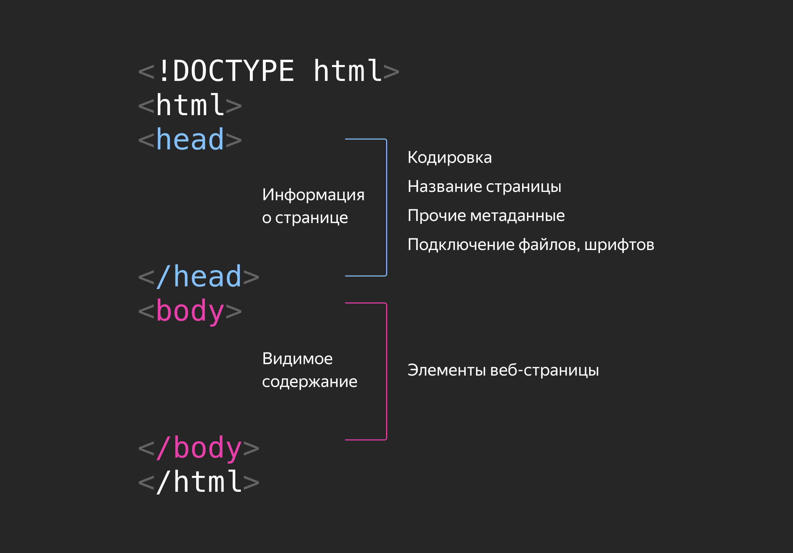
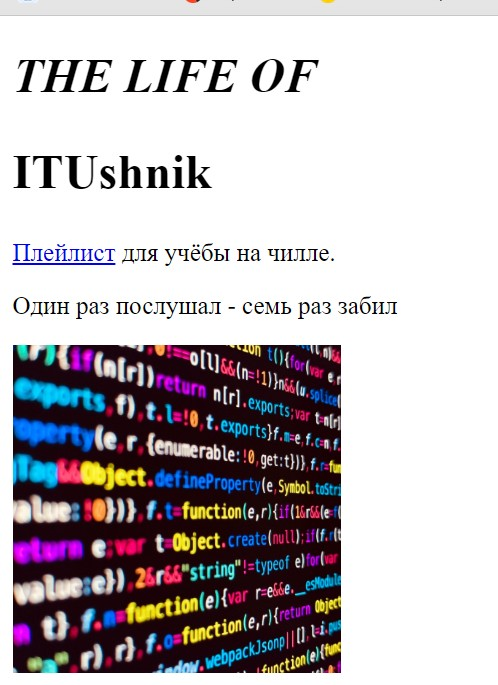

# Знакомство с HTML
___________________________________________________
## Лабораторная работа №3
В данной работе вы познакомитесь с вёрсткой страниц, HTML и стилями.

### [Удобная песочница](https://developer.mozilla.org/ru/play)

### Подготовка
Создайте в директории `solution` файл `index.html` и поместите в него следующий код
```html
<!DOCTYPE html>
<html lang="ru">
  <head>
    <meta charset="UTF-8" />
    <meta name="viewport" content="width=device-width, initial-scale=1.0" />
    <title>Кнопка</title>
  </head>
  <body>
    <button>Дави на педаль</button>
  </body>
</html>
```
Как видно, это голый **html** и выглядит это так себе, в реальности мы можем прописать стиль для каждого элемента прямо в коде,
но это не сильно приятный подход, лучше декомопозировать задачу и добавить стили в отдельный файл.  
Создайте файл `base_styles.css` рядом с вашим html файлом и добавьте туда следующий код.
```css
html {
  height: 100%;
}

body {
  display: flex;
  justify-content: center;
  align-items: center;
  height: 100%;
  margin: 0;
  background-color: #80d994;
}

button {
  border: 1px solid #000;
  padding: 25px 50px;
  color: white;
  font-weight: 900;
  font-size: 30px;
  text-transform: uppercase;
  background-color: grey;
  cursor: pointer;
}
```
Теперь подключите его в вашем html файле в теге `<head>`
```html
<link rel="stylesheet" href="base_style.css" />
```
Вуаля, жить стало веселее. Пора начинать творить.
___________________________________________________
### Задание для работы
#### 0. Нам нужна кнопка:
1. Исправьте название кнопки, пускай она будет называться **Тыкнуть**
2. Создайте документ **style.css** и подключите его к html документу как ещё один файл со стилями
3. Теперь добавьте стили для элемента `button` во вновь созданный файл, цвет текста кнопки должен быть `white` а фон `black`
4. Чёрный? Вы серьёзно? Что за анахронизм из эпохи динозавров. Давайте добавим цвета и сделаем кнопку на свой вкус, выберете любой цвет из таблицы в статье [цвета в вебе](https://doka.guide/css/web-colors/#nazvanie-cveta)

#### 1. Начнём работу над обложкой
Побаловались пора и поработать, давйте начнём наводить порядок в файлах
1. После предыдущего курса у нас остался файл `task_1.html`, с ним что-то не так, исправьте это (Естественно в своей директории)
2. Добавьте в этот же файл, ниже исправленного значения заголовок второго уровня со словом **ITUshnik** [про теги](https://developer.mozilla.org/ru/docs/Web/HTML/Element/Heading_Elements)
3. После заголовков добавьте абзац с фразой `Плейлист для учёбы на чилле`
4. Давайте добавим ещё один абзац с фразой `Один раз послушал - семь раз забил`
5. Пора добавить интерактивности, давайте сделаем слово Плейлист ссылкой для этого вам понадобиться тег `<a>` вот вам [якорь](https://developer.mozilla.org/ru/docs/Web/HTML/Element/a)
6. Тег есть, а ссылки нет так добавьте её https://music.yandex.ru/users/ya.indietronica/playlists/1013
7. Еее сылка работает, но она открывается в текущем окне, а это всё-таки переход на другой сайт. Хммм давайте добавим к нашему тегу `<a>` атрибут `target` со знанием которой скажет браузеру, ей надо открывать в новом окне.
8. Тэкс пора добавить обложку к нашему альбому вам понадобиться тег `img` и изображение `album.png`

9. А что если картинки нет, к примеру она сломана или мы забыли её загрузить. Тогда нам понадобиться атрибут `alt` чтобы отобразить текс заглушки
Добавьте картинке атрибут alt и фразу `Супер-пупер стильный код`
10. Размеры картинки зависят от исходного размера оригинальной картинки, настройте картинку при помощи атрибутов тега установите ширину в **210 px**

#### 2. Поработаем над структурой
Давайте разберём немного подробней структуру `HTML` документа:

Любая веб страница содержит видимую информацию - **body** и не видимую - **head**
В части head содержится вся скрытая дополнительная информация: шрифты, кодировки, подключаемые файлы и т.д.
1. Начиная с первой строки, перед уже написанным кодом, добавьте такие строки:
```html
<!DOCTYPE html>
<html>

</html>
```
2. Теперь давайте добавим между блока html парные теги
```html
<head>

</head>
<body>

</body>
```
3. Конечно ещё не красота, но вы создали структуру `html` Документа. Теперь давайте переместим весь наш код внутрь тега `body`.
Поздравляю вы собрали небольшую веб страницу.

#### 3. Заполним Head
1. Добавьте вашей странице официальное название **The Life of ITUshnik** используйте тег, а вот не скажу какой)))
2. Не забудьте указать кодировку для нашего текста **utf-8**
3. Добавьте иконку к нашему сайту, это будет маленькое изображение отображаемое во вкладке браузера, файл **playlist-favicon.ico**
4. Установите язык `ru` как основной для html страницы

#### 4. Добавим стили
Мы ещё не знакомы с CSS и обязательно к нему вернёмся, пока же давайте настроим стили нашей обложки прямо в тегах.
Свойства и значения разделены двоеточием. После значения всегда стоит точка с запятой, поскольку элемент может иметь много свойств, и нужен разделитель:
```html
<h1 style="color: springgreen; font-size: 72px;">Who let the dogs out</h1>
```
1. Поработаем с размером шрифта для заголовка обложки. Элементу `<h1>` задайте стиль со свойством `font-size` и значением **31** пиксель. В открывающий тег `<h1>` добавьте атрибут `style="font-size: 31px;"`
2. Добавьте заголовку первого уровня свойство для управления регистром и наклоните его, задав начертание курсивом. Вам понадобятся свойства: `text-transform: uppercase;` и `font-style: italic;`. Свойство `font-size: 31px;` удалять у заголовка не нужно.
3. Установите размер шрифта к заголовку второго уровня 31px.

## Сверим часы:
Если вы получили такой же результат как ниже вы молодец:  
