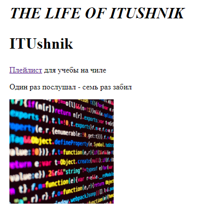
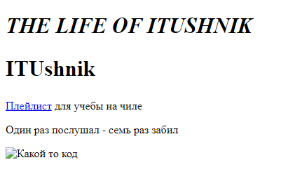

# Лабораторная работа №3

## КОД
```html
<!DOCTYPE html>
<html lang="ru">
<head>
    <meta charset='utf-8'>
    <meta http-equiv='X-UA-Compatible' content='IE=edge'>
    <title>The Life of ITUshnik</title>
    <meta name='viewport' content='width=device-width, initial-scale=1'>
    <link rel='stylesheet' type='text/css' media='screen' href='main.css'>
</head>
<body>
        <h1 style="font-size: 31px; text-transform: uppercase; font-style: italic;">The Life of ITUshnik</h1>
        <h2 style="font-size: 31px;">ITUshnik</h2>
        <p><a href="https://music.yandex.ru/users/ya.indietronica/playlists/1013" target="_blank">Плейлист</a> для учебы на чиле</p>
        <p>Один раз послушал - семь раз забил</p>
        
</body>
</html>
```
__Получили:__  


__Вид с неправильной ссылкой:__  


