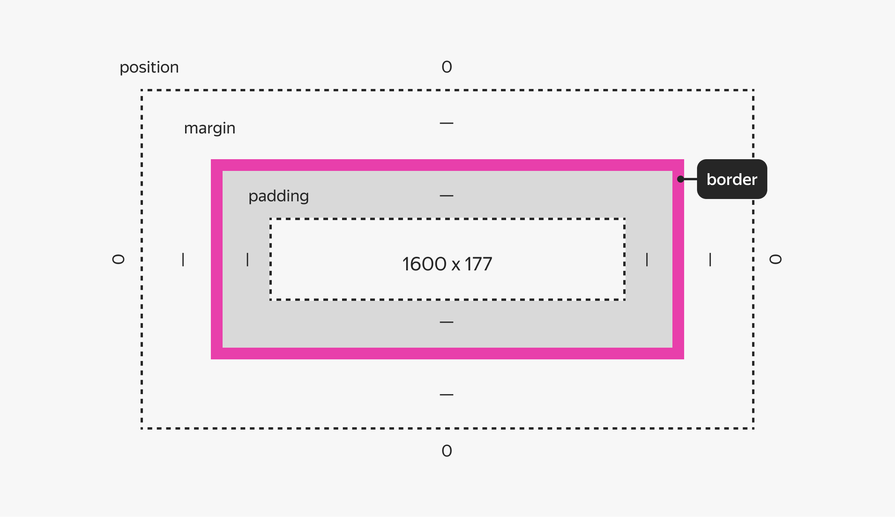
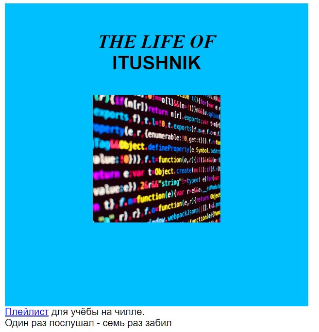

# Знакомство с CSS и продолжение HTML
___________________________________________________
## Лабораторная работа №4
В данной работе вы познакомитесь с вёрсткой страниц, HTML и стилями.
___________________________________________________
### [Удобная песочница](https://developer.mozilla.org/ru/play)

**Внимание, Attention, Danger**
В этой работе вам понадобиться набор файлов из solution 3 ей работы. Так что если вы её не сделали (LOL) пора бы этим заняться.

### Краткое описание
В третьей работы вы уже настраивали стили для различных элементов, такая настройка, когда стиль прописывается атрибутом тега, называется **инлайн**.  
Инлайн стиль идеально подходит для одиночного уникального элемента, однако в случае если таковых элементов +100500 тысяч штук (к примеру 100 абзацев текста) то это решение уже не выглядит столь уж хорошим.

И вот тут на сцену выходят правила стиля CSS. В роли селектора выступает атрибут тега.


**Основные моменты**
- После селектора в фигурных скобках указывают свойства стилей.
- Фигурные скобки вмещают сколько угодно пар **свойство-значение**.
- Каждую новую пару принято писать на следующей строке, а в конце — ставить точку с запятой.
- **Селектор** — не обязательно и далеко не всегда имя тега.

#### Куда ставить то
И так как писать стили в оооообщих чертах понятно, куда их пихать.
Первый вариант, не совсем хороший - прямо в HTML. Можно разместить весь код в <head> и обернуть парынм тегом <style>.
Второй вариант (светлая сторона силы) - перенести всё в файл CSS.
**Мы опробуем оба варианта**
___________________________________________________
#### 1. ЭЭЭЭксперименты
1. Добавьте парные теги `<style>` в `head` **html** файла после всех остальных ссылок и разместите там правила стиля для заголовка `h1`, а из самого заголовка всё удалите.
2. Проделайте ту же операцию с заголовками второго уровня.
3. Отлично, правда html потихоньку превращается в чудовище Франкенштейна. Давайте создадим отдельный файл **style.css** и перенесём туда всё из тега **<style>**. Сам тег и его содержимое можно удалить из html.
4. А теперь давайте подключим стили! Добавьте ссылку на файл со стилями в head вашего html
```html
<head>
  <!-- здесь что-то про кодировку, заголовок, фавиконку -->
  <link rel="stylesheet" href="style.css">
</head> 
```
5. Добавьте свойство для `body` сделайте минимальную ширину равной 850 пикселей
6. Доведём дело до конца на нашем пути разделения ответственности. Создайте правило для тега img и перенесите туда свойство тега img c шириной в 210 пикселей.
7. Немного самостоятельности вам в карму. Добавьте нужные нам шрифты: заголовки первого уровня - `William, serif`, заголовки второго уровня и абзацы - `Inter, sans-serif`
Если всё выглядит также как было, то вы молодец, теперь все стили находятся в отдельном файле.

#### 2. Блоки
Зачастую веб страница и разделяется на блоки (как во внешнем виде, так и в технической реализации).
Как пример ваша стена ВКонтате, Facebook, Ozon и т.д. В подавляющем большинстве на всех страницах можно увидеть отдельные **div** блоки в которые упакована определённая информация
можно увидеть отдельные блоки. Про [div](https://developer.mozilla.org/ru/docs/Web/HTML/Element/div)  

Все страницы складываются из блоков, что также позволяет управлять стилями внутри блоков более гибко.

1. И так у нас есть задача, давайте создадим квадратную форму и цветную обложку для нашего альбома. Поместитм в неё все написанные элементы и разберёмся со стилями
Скопируйте всё, что написано между тегами `<body></body>`, а затем удалите. Создайте парный тег `<div></div>` и вложите в него всё скопированное.
2. В файле **style.css** задайте элементу `<div>` фоновый цвет. В качестве значения неплохо подойдёт `deepskyblue`.
3. Задайте ширину и высоту div блока равные 500pх, обратите внимание на изменения. До изменения ширины и высоты она определялась размерами родительского блока, т.е. блока в который был вложен **div**

#### 3. Отступы
Как видите у текста появились, какие-то пустоты и произвольные отступы. Эй откуда это? Мы так не договаривались.  
На самом деле браузер сам назначил элементы отступов, это поведение по умолчанию. Однако отступы можно настроить чем мы и займёмся [про отступы](https://developer.mozilla.org/en-US/docs/Web/CSS/margin)



1. Сократите до минимума расстояние между заголовками `<h1>` и `<h2>`, и между параграфами. 
Обнулите нижний отступ для селектора `h1` и верхний для селектора `h2`. Для селектора `p` обнулите и нижний, и верхний отступы.
2. Очистим пространство: описание плейлиста перенесём под обложку. Вынесите элементы `p` из `div` и поместите сразу за ним.
3. Разместите название и картинку альбома по центру для этого надо добавить одно свойство в `div` [тык](https://developer.mozilla.org/en-US/docs/Web/CSS/text-align)
Обратите внимание, что вы задали свойство для одного элемента, а применилось оно ко всем.
4. Разберёмся с верхним отступом элемента `h1`. Тут есть проблема, `margin-top` первого дочернего элемента будет отодвигать не элемент от верхней границы родителя, а самого родителя от вышестоящего элемента.
Вместо того чтобы делать отступ наружу, отступим от границы элемента `h1` внутрь. Для элемента `h1` обнулите `margin-top` и назначьте `padding-top` со значением `45px`.
5. Установите для `h2` нижний внешний отступ размером 35px. Так гораздо более предсказуемое поведение чем загадочный отступ по умолчанию.

#### Сверим часы, если вы всё сделали верно то перед вами должна быть такая картинка  



Если это не так, поколдуйте над стилями или помучайте своего преподавателя.

#### 4. Продолжаем
Обложке не хватает подписи с годом и автором плейлиста. После кода изображения в HTML-файл добавьте элемент `<h3></h3>`. 
Добавьте год, допустим, 2023, и псевдоним автора, например, **Veresk V.**

1. Настройте стили для подписи, создайте правило стиля для `h3` и затем:
- установите шрифт `'Inter', sans-serif`
- размер шрифта: `16px`
- текст должен быть `uppercase`
- расстояние между строчками текста `18px`
- насыщенность (толщина) шрифта `normal`
- отступы `0`

2. Сделайте первый заголовок нормальным по толщине.
3. Отодвиньте подпись от изображения: добавьте селектору `img` свойство `margin-bottom` со значением `80px`.
4. Сделайте цвет текста элементов h1 h2 и h3 белым.
5. Давайте разместим нашу обложку по центру страницы, для этого нам понадобиться отступ `margin: 0 auto 20px;` добавьте это правило для `div`
6. Последний штрих, центровка подписи, добавьте `<p>` соответствующий `text-align`
7. Пофантазируйте, можете свободно поменять цвет фона или даже поставить [градиент](https://webgradients.com/), 
если хотите, измените шрифт или замените [картинку](https://unsplash.com/).

### Приятной работы