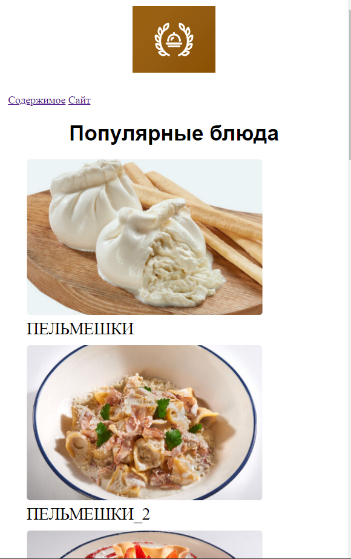
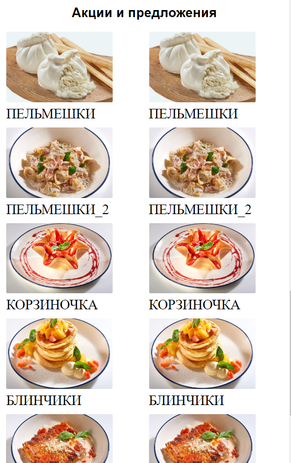
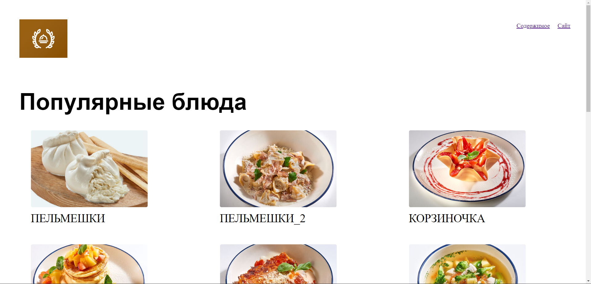
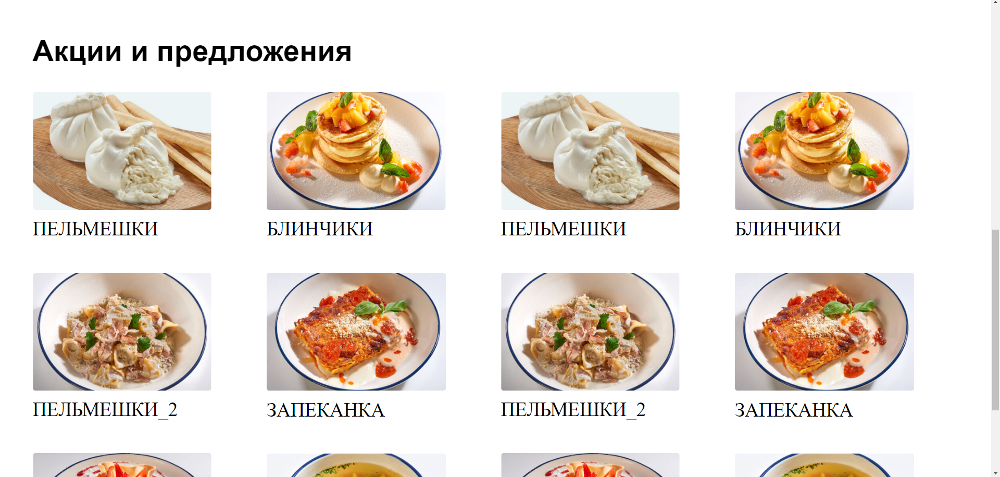

# ЛАБОРАТОРНАЯ РАБОТА №5

# 1. МОБИЛЬНАЯ ВЕРСИЯ



# 2. КОМПЬЮТЕРНАЯ ВЕРСИЯ




# 3. КОД

## HTML
```HTML
<!DOCTYPE html>
<html lang="ru">
<head>
    <meta charset='utf-8'>
    <title>Лабораторная номер №5</title>
    <meta name='viewport' content='width=device-width, initial-scale=1'>
    <link rel='stylesheet' type='text/css' media='screen' href='main.css'>
    <link rel="stylesheet" href="main.css">
    <meta name="viewport" content="width=device-width, initial-scale=1">
    <script src="script.js"></script>

</head>
<body>
    <header>
        <div id="head">
            
        </div>
        <nav>
            <a href="#body">Содержимое</a>
            <a href="https://market-delivery.yandex.ru/">Сайт</a>
        </nav>
    </header>
    <div id="promo"> 
        <h1>Популярные блюда</h1>
    </div>
    <div class="main-catalog">
        <div class="item">
            
            <p>Пельмешки</p>
        </div>
        <div class="item">
            
            <p>Пельмешки_2</p>
        </div>
        <div class="item">
            
            <p>Корзиночка</p>
        </div>
        <div class="item">
            
            <p>Блинчики</p>
        </div>
        <div class="item">
            
            <p>Запеканка</p></div>
        <div class="item">
            
            <p>Супчик</p>
        </div>
    </div>
    <div id="promo">
        <h2>Акции и предложения</h2>
    </div>
    <div class="promo-catalog">
        <div class="item">
            
            <p>Пельмешки</p>
        </div>
        <div class="item">
            
            <p>Пельмешки_2</p>
        </div>
        <div class="item">
            
            <p>Корзиночка</p>
        </div>
        <div class="item">
            
            <p>Блинчики</p>
        </div>
        <div class="item">
            
            <p>Запеканка</p></div>
        <div class="item">
            
            <p>Супчик</p>
        </div>
        <div class="item">
            
            <p>Пельмешки</p>
        </div>
        <div class="item">
            
            <p>Пельмешки_2</p>
        </div>
        <div class="item">
            
            <p>Корзиночка</p>
        </div>
        <div class="item">
            
            <p>Блинчики</p>
        </div>
        <div class="item">
            
            <p>Запеканка</p></div>
        <div class="item">
            
            <p>Супчик</p>
        </div>
    </div>
</body>
</html>
```
## CSS
```CSS
html, body{
    height: 100%;
    padding: 0;
    margin: 0;
    background-color: white;
}

nav{
    margin: 12px;
}

p{
    margin: 0;
}

a:hover{
    text-decoration: none;
}

#promo{
    text-align: center;
}

#head{
    height: 110px;
    text-align: center;
    margin: auto;
    padding: 10px;
}

#logo{
    height: 100px;
    width: 125px;
}

h1, h2{
    font-family: sans-serif;
}

.item{
    margin-bottom: 10px;
    text-align: left;
    font-size: 25px;
    text-transform: uppercase;
}

.item:hover .image{
    opacity: 0.6;
    transition: 0.9s;
}

.image{
    width: 80%;
    height: 80%;
    margin-bottom: 0px;
    margin-top: 0px;
    object-fit: cover;
}

.main-catalog{
    text-align: center;
    align-items: center;
    padding-left: 40px;
    padding-right: 40px;
    margin-top: 20px;
    margin-bottom: 20px;
}

.promo-catalog{
    align-items: center;
    padding-left: 12px;
    padding-right: 12px;
    columns: 2 auto;
}

@media (min-width: 1280px) {
    #promo{
        text-align: left;
        margin-left: 50px;
        font-size: 30px;
    }

    .main-catalog{
        display: flex;
        flex-wrap: wrap;
        justify-content: space-between;
        margin-left: 40px;
        margin-right: 40px;
    }

    .promo-catalog{
        align-items: center;
        padding-left: 10px;
        padding-right: 10px;
        columns: 4 auto;
        margin-left: 40px;
        margin-right: 40px;
    }

    .item{
        margin-bottom: 50px;
        text-align: left;
        font-size: 30px;
        text-transform: uppercase;
    }

    .image{
        margin-bottom: 5px;
    }

    header{
        display: flex;
        flex-wrap: wrap;
        justify-content: space-between;
    }

    #head{
        height: 110px;
        text-align: left;
        margin: 40px;
        margin-bottom: 20px;
        padding: 10px;
    }

    nav{
        display: flex;
        margin-left: 40px;
        margin-right: 40px;
        height: 110px;
        width: 140px;
        text-align: center;
        align-items: center;
        justify-content: center;
        justify-content: space-between;
    }

}
```
</details>