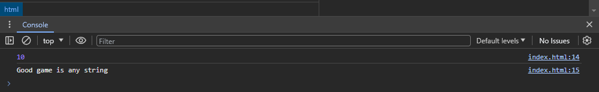
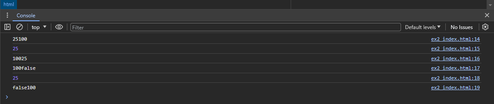
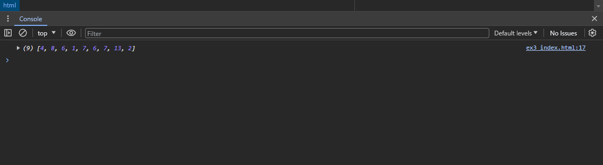
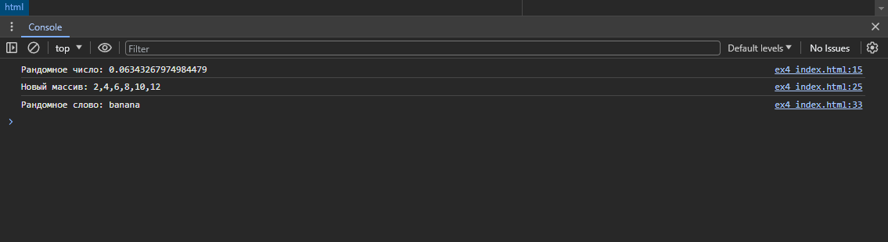
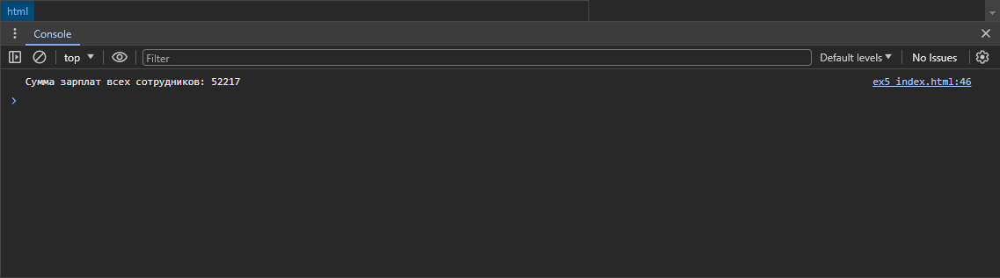
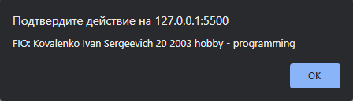

# ЛАБОРАТОРНАЯ РАБОТА №6

## Задание 1

#### КОД:
```HTML
<!DOCTYPE html>
<html lang="ru">
<head>
    <meta charset="UTF-8"/>
    <meta name="viewport" content="width=device-width, initial-scale=1.0"/>
    <title>JS</title>
</head>
<body>
<script>
    let apple = 10;
    let condition = "any string";

    alert(apple);
    console.log(apple);
    console.log('Good game is ' + condition);

</script>
</body>
</html>
```

#### ОТВЕТ В КОНСОЛИ:


#### ОТВЕТЫ НА ВОПРОСЫ
1. Оператор let
2.   const определяет константы, которые нельзя менять после определения.
     var определяет простую, глобальную, внеблочную переменную.
     let переменные имеют блочную видимость, а ещё их нельзя объявить повторно.
3. Alert выводит сообщение в браузере
4. Для дебага

## Задание 2

#### КОД:
```HTML
<!DOCTYPE html>
<html lang="ru">
<head>
    <meta charset="UTF-8"/>
    <meta name="viewport" content="width=device-width, initial-scale=1.0"/>
    <title>JS</title>
</head>
<body>
<script>
    let any_int = 25;
    let any_string = "100";
    let any_bool = new Boolean(false);
    
    console.log(any_int + any_string);
    console.log(any_int + any_bool);
    console.log(any_string + any_int);
    console.log(any_string + any_bool);
    console.log(any_bool + any_int);
    console.log(any_bool + any_string);
</script>
</body>
</html>
```
#### ОТВЕТ В КОНСОЛИ:


### Задание 3

#### КОД:
```HTML
<!DOCTYPE html>
<html lang="ru">
<head>
    <meta charset="UTF-8"/>
    <meta name="viewport" content="width=device-width, initial-scale=1.0"/>
    <title>JS</title>
</head>
<body>
<script>
    let array = [];
    const array_length = 10;

    for(i = 0; i < array_length; i++)
    {
        array[i] = Math.floor(Math.random()* 15);
    }
    console.log(array.filter(FindBiggerThen));

    function FindBiggerThen(x)
    {
        return x > 0;
    }
</script>
</body>
</html>
```
#### ОТВЕТ В КОНСОЛИ:



### Задание 4

```HTML
<!DOCTYPE html>
<html lang="ru">
<head>
    <meta charset="UTF-8"/>
    <meta name="viewport" content="width=device-width, initial-scale=1.0"/>
    <title>JS</title>
</head>
<body>
<script>
    //Задание 1
    function GetRandomNumber()
    {
        return Math.random();
    }
    console.log("Рандомное число: " + GetRandomNumber());

    //Задание 2
    let array = [1, 2, 3, 4, 5, 6];
    function ArrayMultiplication(array)
    {   
        return array.map((item) => {
            return item * 2
        });
    }
    console.log("Новый массив: " + ArrayMultiplication(array));

    //Задание 3
    let words_array = ["apple", "banana", "orange", "grape", "watermelon"];
    let random_word = function() {
        let index = Math.floor(Math.random() * (words_array.length - 0)) + 0;
        return words_array[index];
    }
    console.log("Рандомное слово: " + random_word())
</script>
</body>
</html>
```
#### ОТВЕТ В КОНСОЛИ:

### Задание 5

```HTML
<!DOCTYPE html>
<html lang="ru">
<head>
    <meta charset="UTF-8"/>
    <meta name="viewport" content="width=device-width, initial-scale=1.0"/>
    <title>JS</title>
</head>
<body>
<script>
    let obect = {};
    obect.firstName = 'Ivan';
    obect.surname = 'Kovalenko';
    obect.patronymic = 'Sergeevich';
    obect.birthday = '22.10.2003';
    obect.hobby = 'programming';
    obect.group = 'АСБ-3-037';

    obect.get_inform = function () 
    {
        let year = this.birthday.substring(6, 10);
        let age = 2023 - year;
        let inf = 'FIO: ' + this.surname + ' ' + this.firstName + ' ' + this.patronymic + ' ' + age + ' '  + year + ' hobby - ' + this.hobby;
        return inf;
    }

    alert(obect.get_inform());

    let employees = 
    {
        '1': 1111,
        '2': 2222,
        '3': 3333,
        '4': 4444,
        '5': 5555,
        '6': 6666,
        '7': 7777,
        '8': 8888,
        '9': 9999,
        '10': 2222,
    };
    let general_salary = 0;
    for (let salary in employees)
    {
        general_salary += employees[salary];
    }
    console.log("Сумма зарплат всех сотрудников: " + general_salary);

</script>
</body>
</html>
```
#### ОТВЕТ В КОНСОЛИ:



