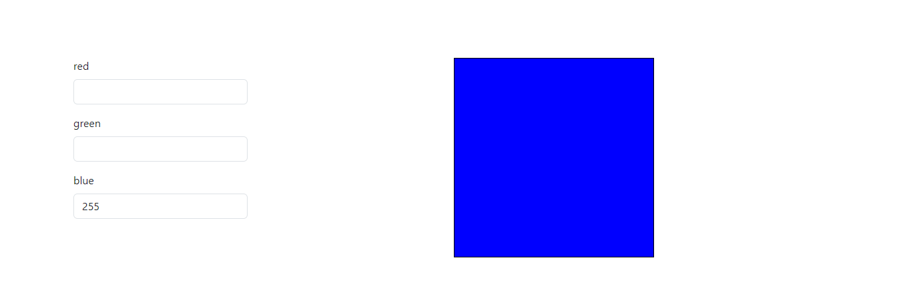
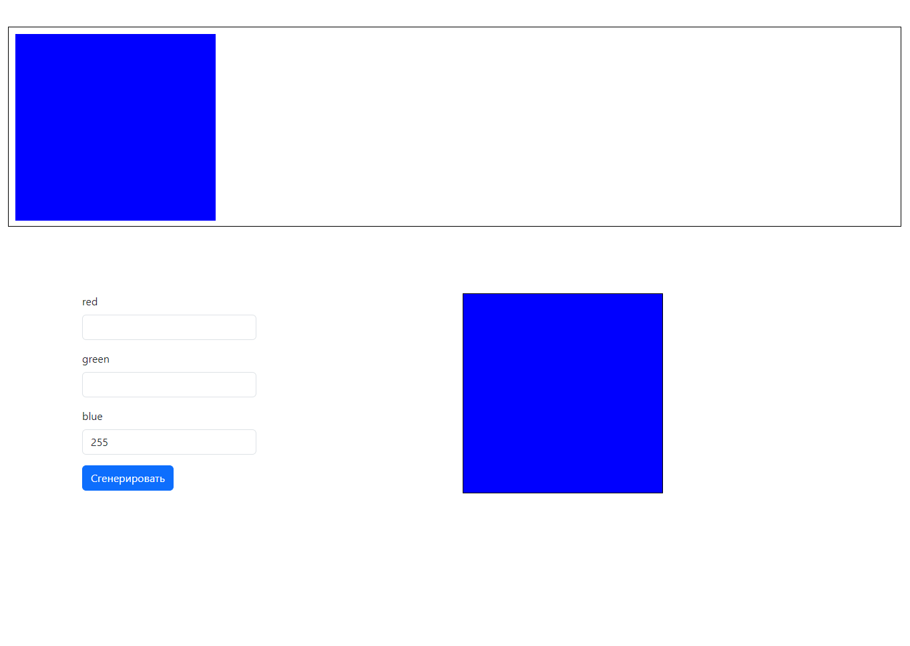

# Обработка событий в java script

___________________________________________________

## Лабораторная работа 7

В данной лабораторной работе Вы познакомитесь с событиями в js  
P.S. Перед тем как начать делать лабораторную необходимо прочесть **README.md**

### Задание 1. Начало (нет не фильм)

1. Необходимо создать файлы index.html и app.js в папке `solution/task1`
2. app.js подключить к index.html
3. Далее в файле сделать верстку где будет 3 кнопки
4. Добавить скрипт, где при нажатии на кнопку будет меняться фон страницы (можно сделать кнопки RGB)

### Задание 2. Добавления функционала

Доработка **Задания 1**.  
Скопировать файлы из директории `solution/task1` в `solution/task2`

1. Создать отдельную область
2. Убрать 3 кнопки, созданные ранее
3. Далее добавить 3 тега `input` и добавить к ним `label` назвать их red, green, blue
4. При добавлении цифр в `input-ы` должен генерироваться цвет фона отдельной области, созданной в пункте 1
5. Добавить валидацию полей (любой способ подойдет)

Пример:

### Задание 3. Работа со списками и объектами на практике

Доработка **Задания 2**.  
Скопировать файлы из директории `solution/task2` в `solution/task3`

1. Добавить область на всю ширину страницы (Высота не менее 300px)
2. Добавить кнопку (надпись у кнопки "Сгенерировать") после `input` с цветами
3. Добавить обработчик событий на новую кнопку. При нажатии на неё будет создаваться блок внутри блока созданном в
   пункте 1
4. При повторном нажатии блоки с новыми цветами должны добавляться, но не более 15шт (спойлер блоки могут не умещаться
   на всю ширину это нормально). Те блоки цветов которые не будут умещаться - прятать. соответственно новые цвета
   перезаписывают старые, если достигли предела в 15 элементов.

### Задание 4. Финальный этап

Доработка **Задания 3**.  
Скопировать файлы из директории `solution/task3` в `solution/task4`

1. При нажатии на блок с цветом (те блоки которые находятся в списке на всю ширину экрана) цвет запоминает браузер
2. Дальше при нажатии на различные блоки страницы, нужно чтобы менялся их фон на цвет сохраненный ранее. При этом
   главная палитра и палитра с созданными цветами не должна подвергаться окраске фона

### Задание 5. Создание слайдера (задание со звездочкой)

Доработка **Задания 4**.  
Скопировать файлы из директории `solution/task4` в `solution/task5`

1. Нужно добавить стрелки к области, где находятся элементы с цветами
2. При нажатии на стрелки должны прокручиваться цвета
3. Если блоков с цветами мало, то скрывать стрелки