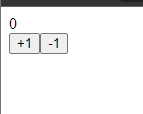
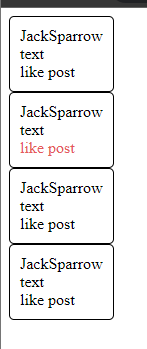
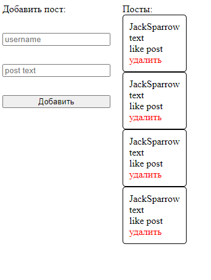
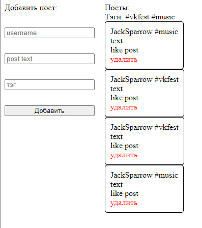

# Знакомство с реакт

> ### В данной работе вы познакомитесь:
> - с самим реактом, с компонентами
> - с хуком состояния компонента 
> - с пропсами  
> - с контекстом

### Подсказка: для быстрого удобства создавайте реакт приложения с помощью команды в консоли npx create-react-app (.)/(name-of-project)

**Задание 1:**
создать обычный счетчик

Одна кнопка увеличивает счет, вторая уменьшает
### Подсказка: использовать хук useState

**Задание 2:**
создать список постов пользоваталей,
пост должен принимать имя пользователя, текст в посте,
так же добавить возможность лайкать посты и визуально показывать лайнутый пост

### Подсказка: использовать хук useState и пропсы

**Задание 3:**  
Добавить возможность добавления постов и удаления

**Задание 4:**  
добавить тэги к постам, выводить отдельно тэги постов без повторения тэгов, 
добавить возможность фильтровать события по тэгам при нажатии на них,
помечать выбранные тэги

### Подсказка: использовать useContext