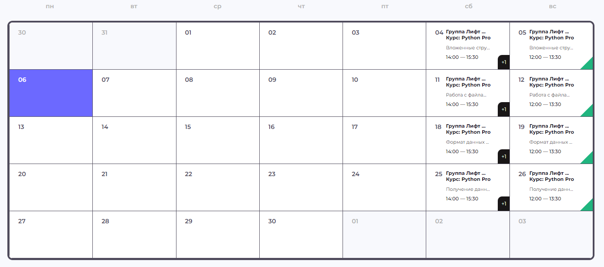

# Задание со здездочкой

Реализовать подобый календарь заметок

> функционал:
> - показ текущего дня
> - показать общую информацию о завметках в конкретном дне(количество, важность и т.д и т.п)
> - нажатие на день с заметкой и переход на другую страницу с более детальной информаицией о заметках
> - страница добавления заметок
> - возможность удалить заметку
> - переключаться между месяцами
> - вывод информации о том какой месяц и год выбраны

> доп. функционал(необязательно)
> - тема темная/светлая, сохранение темы при обновление страницы
> - сделать варицию показа заметок месяц/неделя/день, сохранение вариации при обновлениии страницы
> - оповещать о важных заметках

> Запрещено
> - использовать уже готовое решение, библиотеку дающее готовый календарь

### Все остальное разрешено