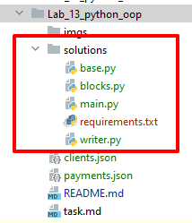
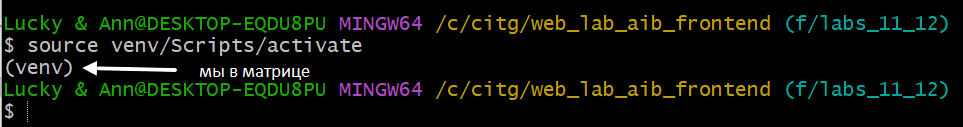

# Лабораторная работа № 13 - ООП Python (по взрослому) 
______________________________________________________________________________
### [Ваше задание](task.md)


## Краткая история
В этой лабораторной вы будете решать аналитическую задачу, будете работать с файлами и соберёте небольшой проект на **python**

Для начала давайте рассмотрим структуру вашего проекта который в итоге будет находиться в директории **solutions**

|  |
|--------------------------------|

______________________________________________________________________________
### Давайте разберёмся, что это за файлы и зачем они нужны.

1) **requirements.txt** - файл с зависимостями проекта, здесь вы перечисляете библиотеки необходимые для запуска вашего проекта
2) **main.py** - точка входа в программу, именно этот файл будет запускаться при проверке
3) **base.py** - файл для хранения базовых абстрактных классов
4) **writer.py** **blocks.py** - файлы для имплементации конкретных классов.

Здесь указано минимальное количество необходимых файлов (с точки зрения автора задания), вы можете предложить другую структуру проекта.

______________________________________________________________________________

#### Работа с зависимостями
<details>
<summary>👇👇👇</summary>

В файле **requirements.txt** перечисляются библиотеки необходимы для проекта, в вашем случае все библиотеки буду загружаться из открытого репозитория пакетов [**PyPi**](https://pypi.org/)
Пример заполнения файла:
```shell
xlsxwriter==3.1.5 # этот пакет вам пригодится
requests==2.31.0
```
Более подробно о наполнении файла можно почитать [**здесь**](https://semakin.dev/2020/04/requirements_txt/?ysclid=lped2v9xmg857110757) и [**здесь**](https://www.freecodecamp.org/news/python-requirementstxt-explained/)

**_Примечание:_** Хорошей практикой является указание точной версии пакета

#### Как собрать проект и работать с ним
Что бы разные проекты на **Python** использующие разные зависимости не пересекались должно использоваться виртуальное окружение (**venv**).  
Для его создания понадобиться [Python](https://www.python.org/downloads/)  
Далее в директории проекта необходимо выполнить в консоли:

```shell
python -m venv venv # последний аргумент имя директории
```

После выполнения этой команды у вам появится директория **venv** в которой будет находиться версия интерпретатора именно для вашего проекта. 
Такой подход позволяет создать целый набор виртуальных окружений с разными версиями **Python**

Следующим шагом мы должны ~~войти в матрицу~~ активировать виртуальное окружение:
```shell
source venv/Scripts/activate # последний аргумент имя директории
```

После этого шага ваша консоль будет выглядеть так:

|  |
|--------------------------------|

В дальнейшем все команды по запуску проекта выполняйте при активированном виртуальном окружении, так вы используете только зависимости и версию интерпретатора окружения.

Чтобы устновить зависимости в окружение вы можете использовать 
```shell
pip instal <package_name>
```
Или, что гораздо удобнее, прописать все зависимости в файле **requirements.txt**  и установить оттуда:
```shell
pip instal -r requirements.txt
```

</details>

______________________________________________________________________________

#### Шпаргалка
<details>
<summary>👇👇👇</summary>

### Шпаргалка
#### Создание абстрактного класса

<details>
<summary>👻👻👻</summary>

```python
from abc import ABCMeta

class Base(metaclass=ABCMeta):
    pass
```

Абстрактный класс по сути является **Интерфейсом** который, определяет поведение всех классов потомков. 
При этом создать экземпляр абстрактного класса нельзя,
на то он и абстрактный.  
Вы можете наделить абстрактный класс необходимым набором методов и атрибутов класса которые будут общими для классов потомков.

**Давайте рассмотрим пример:**
```python
from abc import ABCMeta

class Base(metaclass=ABCMeta):
    NAME = None # атрибут класса
    
    @classmethod  # класс метод для его использования не нужен экземпляр класса 
    def say_hello(cls):
        return cls.NAME # обращение к атрибуту класса

class Ivan(Base):
    NAME = 'Ivan' # переопределение после наследования класса
```

[Подробнее](https://docs.python.org/3/library/abc.html)

</details>

#### Работа с файлами
<details>
<summary>👻👻👻</summary>

Для того чтобы открыт обычный файл можно использовать в следующем формате:
```python
file = open() # открыть файл, возвращает файлподобный объект с доступными методами зависящими от модификатора с которым был открыт файл
# some actions
file.close()
```
После окончания работы с файлом его нужно закрыть, иначе он так и останется открытым на уровне операционной системы.  
Поэтому хорошей практикой является использование файловых дескрипторов, которые автоматически закрывают файл при окончании работы.

```python
with open("file_path", "<mode>", encoding="utf-8") as file:
    # some actions
print("Файл закрыт, а данные в памяти")
```

Подробнее о работе с файлами [читайте здесь](https://docs.python.org/3/library/io.html)

</details>


</details>

______________________________________________________________________________
